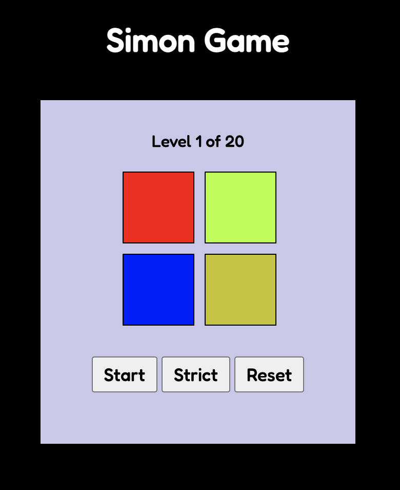

# Simon Game

This is a solution to the [Build a Simon Game](https://www.freecodecamp.org/learn/coding-interview-prep/take-home-projects/build-a-simon-game) from [FreeCodeCamp](https://www.freecodecamp.org/). FreeCodeCamp is a non-profit organization that consists of an interactive learning web platform, an online community forum, chat rooms, online publications and local organizations that intend to make learning web development accessible to anyone. 

## Table of contents

- [Overview](#overview)
  - [The challenge](#the-challenge)
  - [Screenshot](#screenshot)
  - [Links](#links)
- [My process](#my-process)
  - [Built with](#built-with)
- [Author](#author)

## Overview

### The challenge

Users should be able to:

- View the optimal layout for the site depending on their device's screen size
- See hover states for all interactive elements on the page
- Hear a sound that corresponds to each button
- See how many steps are in the current series of button presses
- Play the game in strict mode
- Win the game by getting a series of 20 steps correct
- Restart the game

### Screenshot

### Links

- Solution URL: [https://github.com/Krrish105/simon-game](https://github.com/simon-game)
- Live Site URL: [https://krrish105.github.io/simon-game/](https://krrish105.github.io/simon-game/)

## My process

### Built with

- Semantic HTML5 markup
- CSS custom properties
- CSS Grid
- Mobile-first workflow
- JQuery

## Author

- Frontend Mentor - [Krrish105](https://www.frontendmentor.io/profile/Krrish105)
- Twitter - [_karishma10](https://twitter.com/_karishma10)
- LinkedIn - [Karishma Garg](https://www.linkedin.com/in/karishma-garg-)
- Codepen - [Krrish105](https://codepen.io/krrish105)